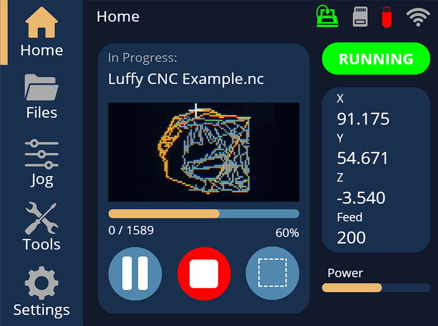
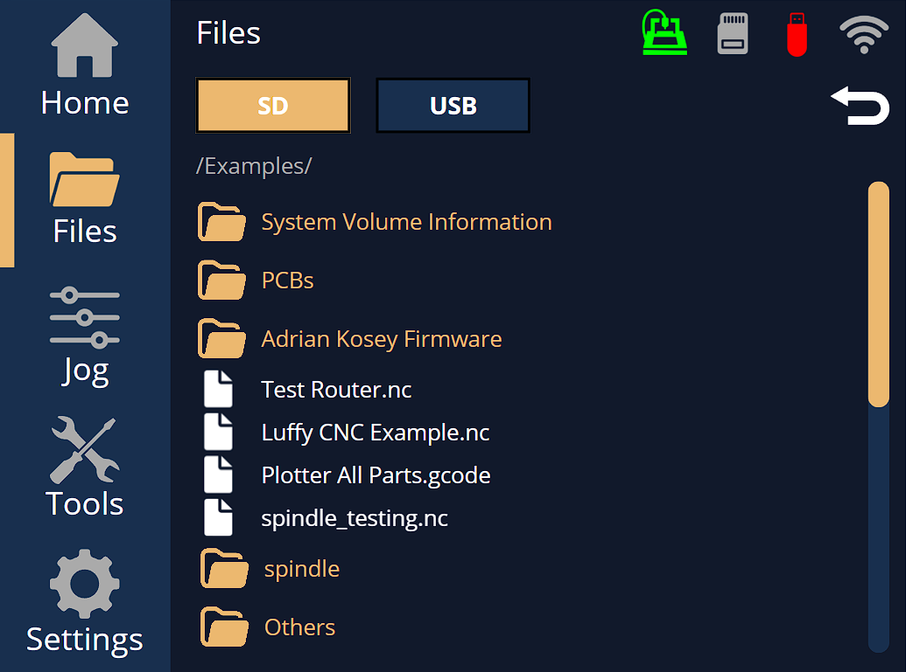
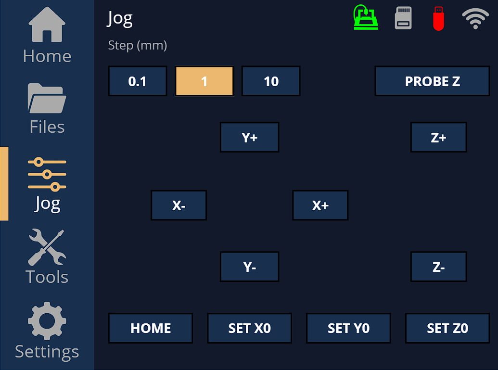
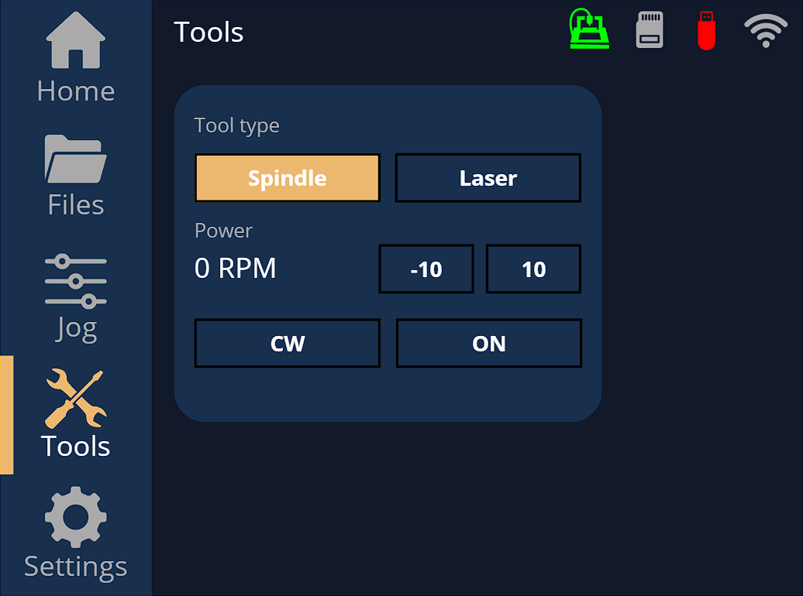
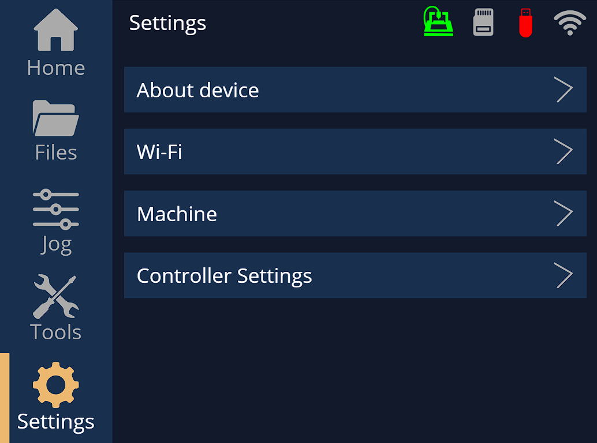
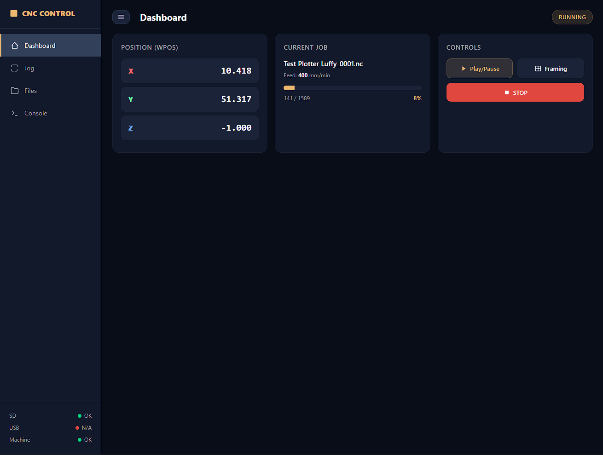
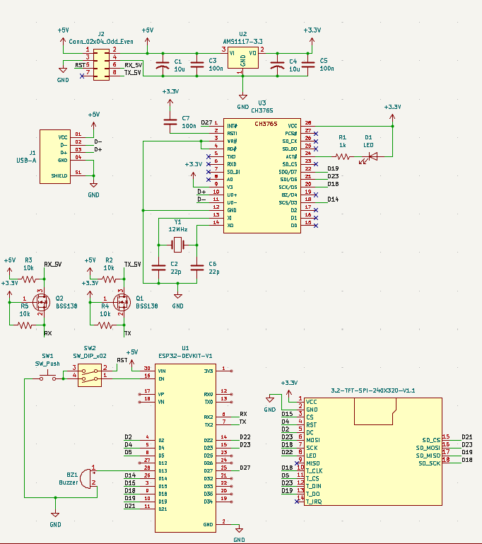
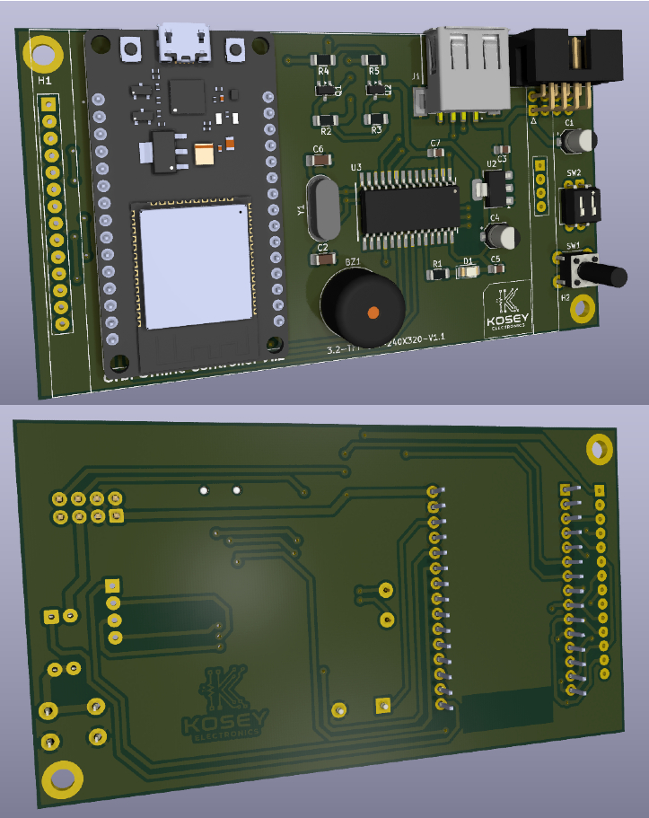

# G-code Offline Controller (ESP32)

<div align="center">
  
  
  
  
  
  
  [](LICENSE)

  *Standalone touch controller for Grbl-controlled CNC machines, based on ESP32 + ILI9341 display.*
</div>

---

This project allows you to load, preview, and execute G-code files without a connected computer. It offers manual machine control (jog, homing, work zero), remote web monitoring, and a robust automatic job recovery system after a power outage.

## 📑 Table of Contents
- [Key Features](#-key-features)
- [Interfaces](#-interfaces)
- [Hardware Requirements](#-hardware)
- [Firmware & Build](#-firmware)
- [Software Architecture](#%EF%B8%8F-architecture)
- [Motivation](#-motivation)
- [License](#-license)

---

## ✨ Key Features

### 🖥️ Display & UI
- **Full Touch Interface:** Fluid design featuring a navigation sidebar and a persistent status header.
- **Home:** 2D G-code toolpath preview with auto-scaling, real-time tool cursor, X/Y/Z coordinates, feed rate, spindle/laser power, job progress, and Play/Pause/Stop/Framing controls.
- **Files:** SD/USB file explorer with folder navigation, momentum scrolling, and automatic G-code file filtering.
- **Jog:** Manual axis control with configurable steps, homing, work zero setting per axis, and touch probe (Probe Z).
- **Tools:** Spindle/Laser control with mode selector, power adjustment, and rotation direction.
- **Settings:** Device info, Wi-Fi configuration, native editing of Grbl parameters (`$$`) using specific controls (toggle/enum/numeric), and general app settings (speeds, language, sound, screen sleep, job recovery).
- **Multilingual:** Native support for English and Spanish.

### ⚙️ Machine Control
- **G-code Streaming:** UART communication with Grbl, featuring a custom parser that tracks the full modal state (position, units, plane, coordinate system, feed, spindle).
- **Live Reading & Editing:** Direct modification of Grbl `$$` parameters on the fly.
- **Power-Loss Job Recovery:** If a power outage occurs, the system detects the interrupted job upon reboot, performs a safe homing cycle, restores the modal state, and resumes from the exact line where it left off (requires the USB/SD memory to remain connected).
- **Framing:** Perimeter bounding box run to verify material positioning before starting the job.

### 💾 Storage
- **Dual Interchangeable Sources:** microSD card and USB drive (via **CH376S** chip), accessible as independent tabs.
- **Full Management:** Browse, load, rename, and delete files or folders from both sources directly on the screen.

### 🌐 Connectivity
- **Smart Wi-Fi:** Auto-reconnection and a fallback Access Point (AP) mode if the known network fails.
- **Remote Web Monitor:** Browser-based dashboard showing real-time status, jog control, file manager (SD/USB) with remote upload, and an interactive live G-code console.

---

## 📸 Interfaces

| 🏠 Home (Preview) | 📂 Files (SD/USB) | 🕹️ Jog (Manual Control) |
| :---: | :---: | :---: |
|  |  |  |

| 🛠️ Tools (Spindle/Laser) | ⚙️ Settings (Configuration) | 🌐 Web Monitor |
| :---: | :---: | :---: |
|  |  |  |

---

## 🔌 Hardware

### Controller Wiring Guides

This schematic illustrates the correct wiring configuration required for the controller to function properly with the firmware.



 ⚠️ **Notes**

* Some components are only available in **SMD format**, which makes them difficult to use without a dedicated PCB. 

* Fortunately, **ready-to-wire modules** are available for these components, simplifying integration.

* Communication with Grbl is done via **UART**. This project acts as a G-code *streamer* and master controller; it does **not** control stepper motors directly.

### Component Availability & Alternatives

| Component | Format | Notes |
| :--- | :--- | :--- |
| **ESP32 Dev Kit** | Through Hole | This version uses the 30-pin ESP32 dev kit.|
| **ILI9341 Touch Display** | Through Hole | The 240x320 TFT-ILI9341 display with a microSD card reader is used.|
| **USB-A Famale** | SMD / Through Hole | USB-A female connector.|
| **IDC Header 2x4** | SMD / Through Hole | 90-degree 8-pin (2x4) IDC header connector|
| **CH376S** | SMD Only | Module version exists. For reading USB drives|
| **AMS1117-3.3** | SMD Only | Available as a module. Any 3.3V regulator can also be used.|
| **BSS138** | SMD Only | Modules using this MOSFET work equally well as level shifters. |

### Component Availability & Alternatives

I have designed a dedicated PCB in KiCad. Using the [Gerber files](docs/gerber/Gcode-Offline-Controller.zip) provided in this repository, you can have it manufactured or even make it yourself, as I ensured that the pin pads do not require soldering from the top side.



> **NOTE:** To mount the display, you must solder on female headers to provide enough clearance for the components located underneath it.

---

## 💻 Firmware

This project is built with [PlatformIO](https://platformio.org/) on top of the Arduino framework for ESP32.

**Main Libraries:**
- [`TFT_eSPI`](https://github.com/Bodmer/TFT_eSPI) — Highly optimized display driver.
- [`Ch376msc`](https://github.com/djuseeq/Ch376msc) — Support for USB drive communication.

### Compile and Upload

1. Clone the repository.
2. Open the project in VS Code with PlatformIO.
3. Navigate to the `.pio` and `libdeps` folders to modify the **TFT_eSPI** library.
4. Open the `User_Setup_Select.h` file and comment out line **#27**:
```User_Setup_Select.h
// #include <User_Setup.h>
```
5. Uncomment line #76:
```User_Setup_Select.h
#include <User_Setups/Setup42_ILI9341_ESP32.h>
```
6. In the library's `User_Setups` folder, locate the `Setup42_ILI9341_ESP32.h` file and uncomment line #14 to enable the touchscreen:
```User_Setups/Setup42_ILI9341_ESP32.h
#define TOUCH_CS 5 // Chip select pin (T_CS) of touch screen
```
8. Configure your hardware pins according to the provided schematic, or adjust the `include/pins.h` file to match your custom wiring.
9. Run the build/upload command:

```bash
pio run --target upload
```

## 🏗️ Architecture
To guarantee fluidity and maximize the performance of the ESP32, the project does not rely on heavy external GUI libraries (like LVGL). Instead, it implements a custom widget architecture:
```
src/
├── app/            # Main application logic
├── display/        # Display driver abstraction (driver/interface pattern)
├── touch/          # Touch event handling (Pressed/Move/Released with debounce)
├── gui/            # Native graphic system
│   ├── core/       # Base Widget, ScreenManager, Header, Sidebar, scroll containers
│   ├── widgets/    # Buttons, sliders, toggles, lists, etc.
│   └── screens/    # App screens (Home, Files, Jog, Tools, Settings)
├── gcode/          # G-code parser, file analysis, and 2D simulator
├── machine/        # UART communication with Grbl, job execution, and recovery
├── storage/        # Storage abstraction layer (unified SD / USB)
├── network/        # Wi-Fi management, OTA, and embedded web server
└── i18n/           # Internationalization and translation system
```

**Performance:** Each widget manages its own redraw state (dirty flag), preventing screen flickering and minimizing the rendering load. This is critical since the UI and G-code streaming share the same resources on the ESP32.

## 💡 Motivation
This project was built piece by piece, iterating over the real daily needs of working in a CNC workshop. It started as a basic UI to avoid bringing a laptop to the machine, and evolved to include industrial-grade features like power-loss job recovery (saving expensive materials and machining hours). It remains in active development.

## 📄 License
This project is distributed under the Apache 2.0 license. See the [LICENSE](LICENSE) file for more details.
